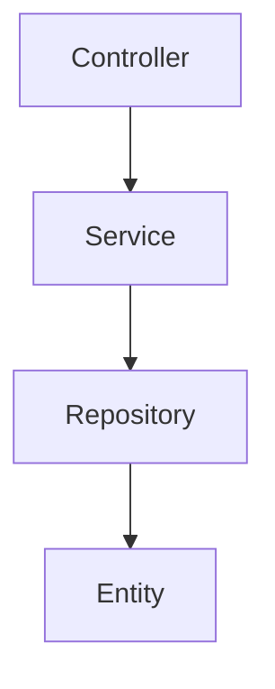
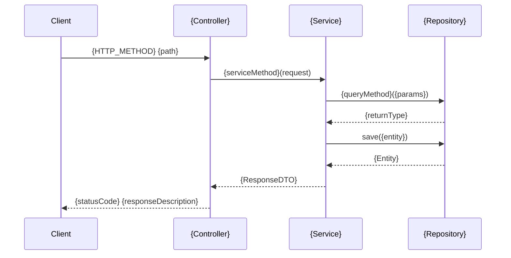
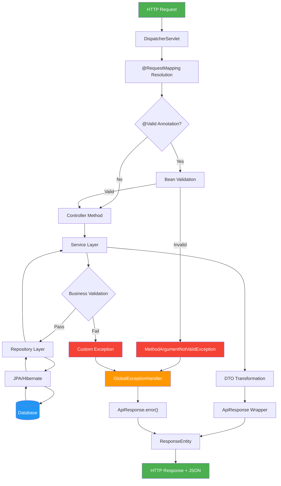
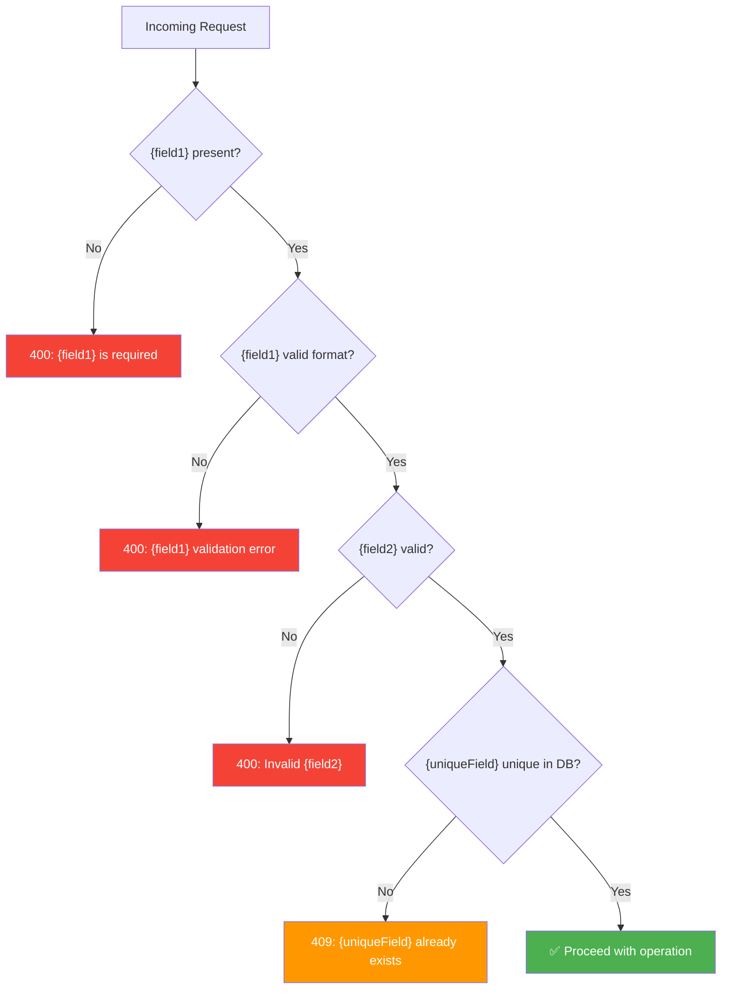
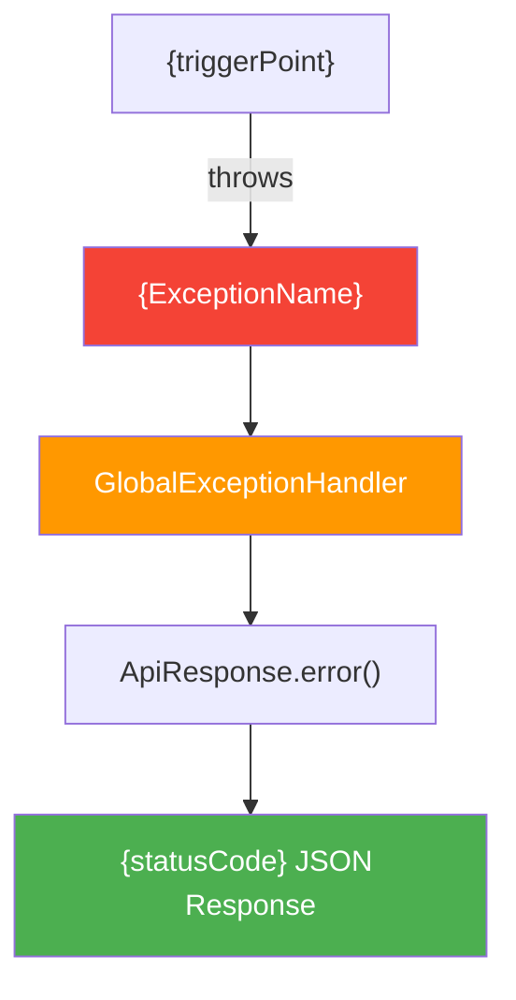

# Diagram Templates

Templates for standalone diagram files generated in `docs/diagrams/`. All diagrams use Mermaid syntax.

## Placeholder Resolution

Resolve `{placeholders}` from source code using these rules:

| Placeholder | Source |
|-------------|--------|
| `{ControllerName}` | Class annotated `@RestController` |
| `{ServiceName}` | Class annotated `@Service` |
| `{RepositoryName}` | Interface annotated `@Repository` or extending `JpaRepository` |
| `{EntityName}` | Class annotated `@Entity` |
| `{EnumName}` | Java `enum` types |
| `{ExceptionName}` | Classes extending `RuntimeException` or `Exception` |
| `{RequestDTO}` / `{ResponseDTO}` | Classes suffixed `RequestDto` / `ResponseDto` |
| `{TABLE_NAME}` | Value from `@Table(name=...)` or snake_case of entity class name |

---

## Full Project Class Diagram (CLASS_DIAGRAM.md)
Generate a COMPLETE class diagram of the entire project showing every class, interface, enum, and their relationships:
```mermaid
classDiagram
    %% Controllers
    class {ControllerName} {
        -{ServiceType} {service}
        +ResponseEntity~ApiResponse~ {method}({params})
    }

    %% Services
    class {ServiceName} {
        -{RepositoryType} {repo}
        +{ReturnType} {method}({params})
    }

    %% Repositories
    class {RepositoryName} {
        <<interface>>
        +Optional~{Entity}~ {findMethod}({params})
        +boolean {existsMethod}({params})
        +List~{Entity}~ {listMethod}({params})
        +long {countMethod}({params})
    }

    %% Entities
    class {EntityName} {
        -Long id
        -{type} {field}
        +{getter}()
        +{setter}()
    }

    %% DTOs
    class {RequestDTO} {
        -{type} {field}
        +{EntityName} toEntity()
    }
    class {ResponseDTO} {
        -{type} {field}
        +{ResponseDTO} fromEntity({EntityName})
    }
    class ApiResponse~T~ {
        -boolean success
        -String message
        -T data
        -int statusCode
        +ApiResponse~T~ success()
        +ApiResponse~T~ created()
        +ApiResponse~T~ error()
    }

    %% Enums
    class {EnumName} {
        <<enumeration>>
        {VALUE_1}
        {VALUE_2}
        {VALUE_3}
    }

    %% Exceptions
    class {ExceptionName} {
        +{ExceptionName}(String message)
    }
    class GlobalExceptionHandler {
        +ResponseEntity handle{Exception}({ExceptionType} ex)
    }

    %% Relationships
    {ControllerName} --> {ServiceName} : uses
    {ServiceName} --> {RepositoryName} : uses
    {RepositoryName} ..> {EntityName} : manages
    {EntityName} --> {EnumName} : has
    {ControllerName} ..> {RequestDTO} : receives
    {ControllerName} ..> {ResponseDTO} : returns
    {ControllerName} ..> ApiResponse~T~ : wraps response
    {ServiceName} ..> {RequestDTO} : consumes
    {ServiceName} ..> {ResponseDTO} : produces
    {ServiceName} ..> {ExceptionName} : throws
    GlobalExceptionHandler ..> {ExceptionName} : handles
    RuntimeException <|-- {ExceptionName}
```

---

## Entity Relationship Diagram (ENTITY_RELATIONSHIP.md)
Generate a database-level ER diagram:
```mermaid
erDiagram
    {TABLE_NAME} {
        {col_type} {col_name} PK "auto-generated"
        {col_type} {col_name} UK "unique"
        {col_type} {col_name} "not null"
        {col_type} {col_name} "nullable"
    }
    {PARENT_TABLE} ||--o{ {CHILD_TABLE} : "{relationship}"
```

---

## Dependency Graph (DEPENDENCY_GRAPH.md)


---

## Sequence Diagrams (SEQUENCE_DIAGRAMS.md)
For each major endpoint, generate:


---

## Complete Request Flow (FLOW_DIAGRAMS.md)
Generate end-to-end request processing flow:


---

## Validation Decision Tree (FLOW_DIAGRAMS.md)
Generate decision flow for all validation rules:


> **Note:** Enumerate every `@NotBlank`, `@Size`, `@Pattern`, `@Email`, and custom uniqueness check from the actual DTO and service. Each validation rule becomes a decision node.

---

## Exception Flow (EXCEPTION_FLOW.md)
Generate a flowchart showing how every custom exception travels to the HTTP response:

> Repeat one branch per custom exception class. Use the `@ExceptionHandler` mappings in `GlobalExceptionHandler` as the source of truth.

---

## Coverage Matrix
Generate a cross-reference matrix:

| Component | Has Tests | Test File | Methods Tested |
|-----------|-----------|-----------|----------------|
| {ServiceName} | ✅ | {ServiceName}Test.java | {tested}/{total} |

---

## Mermaid Syntax Rules

Before writing any diagram file, verify:
- Node labels containing spaces, colons, or special characters are wrapped in "quotes"
- No duplicate node IDs within the same diagram
- `flowchart` uses `-->`, not `->` (that is for `sequenceDiagram`)
- No reserved keywords (`end`, `graph`, `subgraph`) used as bare node IDs
