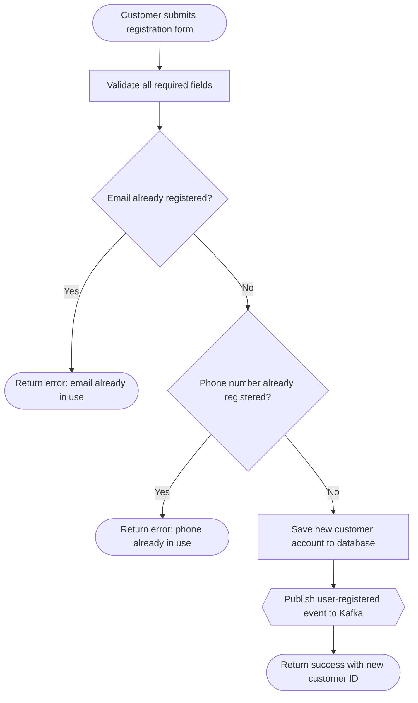
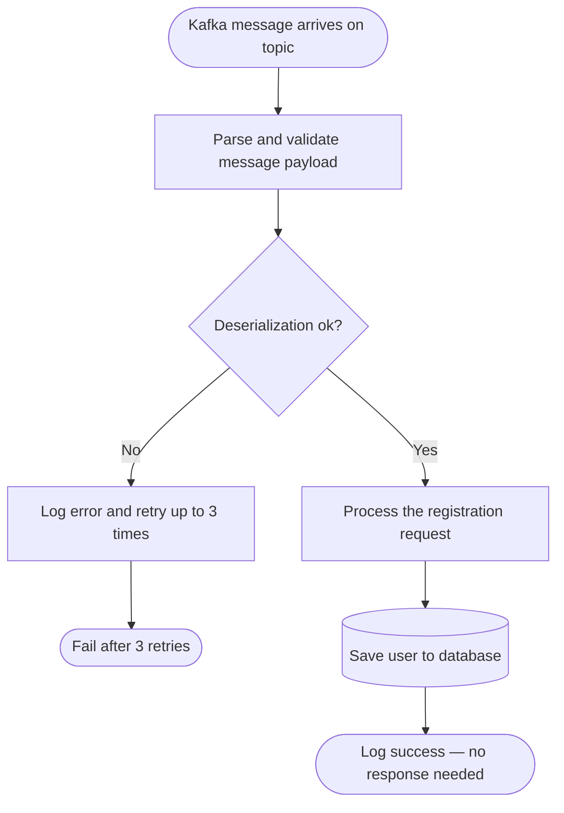

# Feature Documentation Instructions

This file defines how the agent discovers, traces, and writes **plain-English feature documents** with data flow diagrams.

Feature documentation is generated automatically as part of:
- **Mode 1 (Full Scan)** — generated as the final phase after all other docs
- **Mode 2 (Git-Based Update)** — regenerated for any feature whose entry point, service, or repository was changed

---

## Step 1: Discover Entry Points

Scan the entire project and identify ALL entry points. These are the starting points of every feature.

Also scan `specs/` (if present) to discover planned or in-progress features that may not yet have source code. Each subfolder under `specs/` typically contains a `spec.md` with requirements — use these to populate the "Related Specifications" field in generated feature documents.

| Entry Point Type | What to Look For |
|---|---|
| **REST Controller** | Classes annotated `@RestController` or `@Controller` — each HTTP method (`@GetMapping`, `@PostMapping`, `@PutMapping`, `@PatchMapping`, `@DeleteMapping`) is one feature |
| **Kafka / Message Listener** | Methods annotated `@KafkaListener`, `@RabbitListener`, `@SqsListener`, `@JmsListener` — each listener method is one feature |
| **Scheduler** | Methods annotated `@Scheduled` — each scheduled method is one feature |
| **Event Listener** | Methods annotated `@EventListener` or `@TransactionalEventListener` |
| **GraphQL Resolver** | Methods annotated `@QueryMapping`, `@MutationMapping`, `@SubscriptionMapping` |
| **gRPC Service** | Classes implementing generated gRPC service stubs |

List all discovered entry points grouped by type before proceeding. Example:

```
Discovered Entry Points:
  REST Controllers (3):
    - POST /api/users          → UserController.registerUser()
    - GET  /api/users/{id}     → UserController.getUserById()
    - DELETE /api/users/{id}   → UserController.deleteUser()
  Kafka Listeners (1):
    - Topic: user.events       → UserKafkaListener.handleUserEvent()
  Schedulers (0): none found
```

---

## Step 2: Trace Each Functional Flow

For every entry point, follow the complete call chain from top to bottom:

```
Entry Point (Controller method / Listener method / Scheduled method)
  └── Calls → Service method(s)
        └── Calls → Repository / external API / Kafka producer / cache / email
              └── Returns → Data or side-effect
                    └── Back up to → HTTP response / emitted event / DB write
```

For each flow, collect:

| What to Collect | Description |
|---|---|
| **Trigger** | What starts this — HTTP call, message arrival, timer tick, application event |
| **Input data** | Request body fields, path variables, query params, message payload, schedule params |
| **Steps** | What each service method actually does, in plain English (not code, just behavior) |
| **Decision points** | if/else branches that change the outcome (e.g., "if email already exists → reject") |
| **Data touched** | Which database tables, collections, or caches are read or written |
| **Output** | Response body returned, event published, file written, email sent, record saved |
| **Error cases** | What happens when validation fails, resource not found, system error, etc. |

---

## Step 3: Group Into Logical Features

Group related entry points into one **Feature** document when they form a single user-facing capability.

**Grouping examples:**
- `POST /api/users` + `GET /api/users/{id}` + `DELETE /api/users/{id}` → Feature: **User Management**
- `POST /api/orders` + Kafka listener `order.payment.confirmed` → Feature: **Order Processing**
- A single `@Scheduled` method → Feature: **Nightly Report Generation**

If a single endpoint is complex enough on its own, it can be its own feature document.

---

## Step 4: Feature Document Template

For each feature, generate a Markdown file using this exact structure:

```markdown
# Feature: {Feature Name}
_Auto-generated: {date}_

---

## What is this feature?
{2–4 sentences in plain English. No technical jargon. A business stakeholder or new team member should understand this without any coding knowledge.}

## Who uses it?
{e.g., "A customer signing up for the first time", "An internal background job running every night", "An external order service sending a Kafka message"}

## How is it triggered?
{Plain English: "A user sends a registration request via the mobile app" or "A Kafka message arrives when a payment is confirmed" or "Automatically runs every night at 2 AM"}

---

## Step-by-Step Flow
1. {Plain English step — what happens first}
2. {Plain English step — what is validated or checked}
3. {Plain English step — what decision is made and why}
4. {Plain English step — what is saved or sent}
5. {Plain English step — what is returned or published}
...

---

## Data Flow Diagram
{Mermaid flowchart — follow the rules in Step 5 below}

---

## Input Data
| Field | Type | Required | Description |
|---|---|---|---|
| {field} | {type} | Yes / No | {what it means in plain English} |

---

## Output / Result
{Plain English description of what the caller/consumer gets back — HTTP response body, Kafka event payload, side-effects like an email sent or DB record created}

---

## Error Cases
| Situation | What Happens |
|---|---|
| {e.g., Email already registered} | {e.g., Returns a 409 Conflict error with a clear message} |
| {e.g., Invalid input data} | {e.g., Returns a 400 Bad Request with field-level error details} |

---

## Technical Entry Points
| Layer | Class | Method | File |
|---|---|---|---|
| Controller / Listener / Scheduler | {ClassName} | {methodName()} | {path/to/File.java} |
| Service | {ClassName} | {methodName()} | {path/to/File.java} |
| Repository | {ClassName} | {methodName()} | {path/to/File.java} |

---

## Related Features
- [Feature Name](FEATURE_{NAME}.md)

## Related Specifications
{If a `specs/` folder exists, list any spec whose scope covers this feature.}
| Spec ID | Title | Link |
|---------|-------|------|
| {spec_folder_name} | {title from spec.md} | [View](../../specs/{spec_folder_name}/spec.md) |
{If no matching spec exists, write: "No matching specification found."}
```

---

## Step 5: Data Flow Diagram Rules

Every feature document **MUST** include a **Mermaid flowchart** showing the data flow.

### Orientation
- Use `flowchart TD` (top-down) for step-by-step sequential flows
- Use `flowchart LR` (left-right) for data pipelines or transformation chains

### Node Labels — Plain English ONLY
Write what a step **does**, not which class/method runs it.

| ✅ Good | ❌ Bad |
|---|---|
| `Validate email is not already taken` | `userService.checkEmailDuplicate()` |
| `Save new user to database` | `userRepository.save(user)` |
| `Publish event to Kafka` | `kafkaTemplate.send(topic, dto)` |

### Node Shapes
- `[Step]` — regular process step (rectangle)
- `{Decision?}` — branching decision (diamond)
- `([Start / End])` — entry or exit point (stadium)
- `[(Database)]` — database read/write (cylinder)
- `{{External System}}` — Kafka, email server, third-party API

### Diagram Size
- Maximum **12–15 nodes** per diagram
- If the flow is longer, split into a **Main Flow** diagram and one or more **Sub-Flow** diagrams

### Example — User Registration



### Example — Kafka Listener Flow



---

## Step 6: Feature Index

Always create or update `docs/features/FEATURE_INDEX.md` after generating or updating any feature document.

```markdown
# Feature Index
_Auto-generated: {date}_

| # | Feature Name | Entry Point Type | Trigger | Status | Document |
|---|---|---|---|---|---|
| 1 | User Registration | REST POST | POST /api/users | ✅ Current | [View](FEATURE_USER_REGISTRATION.md) |
| 2 | Get User Profile | REST GET | GET /api/users/{id} | ✅ Current | [View](FEATURE_GET_USER_PROFILE.md) |
| 3 | Process User Event | Kafka Listener | Topic: user.events | ✅ Current | [View](FEATURE_PROCESS_USER_EVENT.md) |
| 4 | Nightly Cleanup Job | Scheduler | Every day at 2 AM | ✅ Current | [View](FEATURE_NIGHTLY_CLEANUP.md) |
```

---

## Step 7: Output File Naming

| Convention | Example |
|---|---|
| Index file | `docs/features/FEATURE_INDEX.md` |
| REST feature | `docs/features/FEATURE_USER_REGISTRATION.md` |
| Listener feature | `docs/features/FEATURE_PROCESS_ORDER_EVENT.md` |
| Scheduler feature | `docs/features/FEATURE_NIGHTLY_REPORT.md` |

Use SCREAMING_SNAKE_CASE after `FEATURE_`.

---

## Feature Update Rules (Mode 2 — Git-Based)

When running a git-based update, check the **Feature Change Matrix** to decide which feature docs need regenerating:

| Changed File Type | Affected Feature Docs |
|---|---|
| `*Controller.java` | All features whose entry point is in that controller |
| `*Listener.java` | All features triggered by that listener |
| `*Scheduler.java` / `*Job.java` | All features triggered by that scheduler |
| `*Service.java` | All features that call a method in that service |
| `*Repository.java` | All features that read/write through that repository |
| `*Entity.java` / `*Model.java` | All features that touch that entity (input, output, or stored) |
| `*DTO.java` / `*Request.java` / `*Response.java` | Features that use that DTO as input or output |
| `*ExceptionHandler.java` | All features — update Error Cases sections |

When updating a feature doc, regenerate only the affected sections (Flow, Data Flow Diagram, Input Data, Output, Error Cases) rather than the entire document. Always update the timestamp and add a line to CHANGELOG.md.
