# Knowledge Graph Templates

Templates for the `docs/knowledge-graph/` folder. These generate node-edge representations of the entire project for impact analysis and onboarding.

> **Dual Output Rule:** Every knowledge graph generation pass MUST produce **two parallel outputs** for each service:
> 1. **Markdown** (`*.md`) — human-readable, checked into `docs/knowledge-graph/`
> 2. **JSON** (`graph/*.json`) — machine-readable, checked into `docs/knowledge-graph/graph/`
>
> The JSON files are the foundation for Neo4j ingestion and multi-service impact analysis. They must be generated in the same doc agent pass — never derived by parsing the Markdown output.

---

## Graph Export Templates (JSON — Machine-Readable)

Generate these three files alongside every Markdown knowledge graph. All three live in `docs/knowledge-graph/graph/`.

### File: `docs/knowledge-graph/graph/nodes.json`

One entry per class, method, Kafka topic, REST endpoint, and database table discovered in the service.

**Node type rules:**
| Source element | `type` value | `id` format |
|----------------|-------------|-------------|
| Java class (Controller/Service/etc.) | `Class` | `{service-name}::{ClassName}` |
| Java method | `Method` | `{service-name}::{ClassName}.{methodName}()` |
| Business validation/condition extracted from method body | `BusinessRule` | `{service-name}::{ClassName}.{methodName}::rule::{n}` |
| Enum status / state value | `State` | `{service-name}::{EnumName}.{VALUE}` |
| Kafka topic (from `@KafkaListener`, `KafkaTemplate.send()`) | `KafkaTopic` | `kafka::{topic-name}` |
| REST endpoint (from `@RequestMapping`, `@GetMapping`, etc.) | `RestEndpoint` | `{service-name}::{HTTP_METHOD} {path}` |
| JPA entity / DB table | `DbTable` | `db::{table_name}` |
| Custom exception class | `Exception` | `{service-name}::{ExceptionName}` |

**BusinessRule extraction rules** — create a `BusinessRule` node whenever the method body contains:
- An `if` condition that leads to `throw new XException()` → rule = the guard condition in plain English
- A `@Valid` or JSR-303 annotation check that gates the method → rule = the validation constraint
- A uniqueness/duplicate check via repository before a save → rule = the constraint being enforced
- A status/state guard (`if (order.getStatus() != PENDING) throw ...`) → rule = the state pre-condition

```json
[
  {
    "id": "{service-name}::{ClassName}",
    "service": "{service-name}",
    "label": "{ClassName}",
    "type": "Class",
    "layer": "Controller|Service|Repository|Model|Exception|Config",
    "file": "src/main/java/{package}/{ClassName}.java"
  },
  {
    "id": "{service-name}::{ClassName}.{methodName}()",
    "service": "{service-name}",
    "label": "{methodName}()",
    "type": "Method",
    "parent": "{service-name}::{ClassName}",
    "file": "src/main/java/{package}/{ClassName}.java",
    "line": "{line_number}",
    "purpose": "{one-line plain-English description of what this method does}",
    "transactional": true,
    "transactionType": "readWrite|readOnly|none",
    "annotations": ["@Transactional", "@Override", "@PreAuthorize"],
    "throwsOn": [
      { "exception": "{service-name}::{ExceptionName}", "condition": "{plain-English guard condition}" }
    ],
    "stateTransitions": [
      { "entity": "{EntityName}", "from": "{STATUS_A}", "to": "{STATUS_B}" }
    ]
  },
  {
    "id": "{service-name}::{ClassName}.{methodName}::rule::{n}",
    "service": "{service-name}",
    "label": "{plain-English rule description}",
    "type": "BusinessRule",
    "parent": "{service-name}::{ClassName}.{methodName}()",
    "enforcedBy": "{service-name}::{RepositoryOrClass}.{checkMethod}()",
    "violationThrows": "{service-name}::{ExceptionName}",
    "violationStatus": "{HTTP status code, e.g. 409}"
  },
  {
    "id": "{service-name}::{EnumName}.{VALUE}",
    "service": "{service-name}",
    "label": "{VALUE}",
    "type": "State",
    "enum": "{service-name}::{EnumName}"
  },
  {
    "id": "kafka::{topic-name}",
    "label": "{topic-name}",
    "type": "KafkaTopic"
  },
  {
    "id": "{service-name}::{HTTP_METHOD} {path}",
    "service": "{service-name}",
    "label": "{HTTP_METHOD} {path}",
    "type": "RestEndpoint"
  },
  {
    "id": "db::{table_name}",
    "label": "{table_name}",
    "type": "DbTable"
  }
]
```

---

### File: `docs/knowledge-graph/graph/edges.json`

One entry per directed relationship between two nodes within the same service.

**Edge type rules:**
| Source pattern | `relationship` | Direction | Notes |
|----------------|---------------|-----------|-------|
| `@Autowired` / `@RequiredArgsConstructor` field injection | `INJECTS` | Class → Class | Structural wiring |
| Direct method call `a.b()` | `CALLS` | Method → Method | Add `condition` if the call is guarded by an `if` |
| `@RequestBody` parameter | `RECEIVES_DTO` | Method → Class (DTO) | |
| `ResponseEntity` return | `RETURNS_DTO` | Method → Class (DTO) | |
| `throw new XException()` | `THROWS` | Method → Exception | |
| `@ExceptionHandler(X.class)` in a `@RestControllerAdvice` class | `HANDLES` | HandlerClass → Exception | **Required:** emit one `HANDLES` edge per `@ExceptionHandler` annotation; source is the `@RestControllerAdvice` class node, target is the exception class node. Never skip. |
| `JpaRepository<Entity, ID>` | `MANAGES` | Repository → Entity | |
| `@Entity` + `@Table(name=...)` | `MAPS_TO` | Entity → DbTable | |
| `KafkaTemplate.send()` | `PUBLISHES_TO` | Method → KafkaTopic | |
| BusinessRule node extracted from method | `APPLIES_RULE` | Method → BusinessRule | Semantic: method enforces this rule |
| BusinessRule enforced by a repository/service check | `VALIDATED_BY` | BusinessRule → Method | Points to the check method (e.g. `existsBy…`) |
| `if (entity.getStatus() != X) throw …` | `GUARDS` | State → Method | State is a pre-condition for the method |
| `entity.setStatus(Y)` inside a method | `TRANSITIONS_TO` | Method → State | Method drives this state change |
| Known valid status transition `A → B` (from service logic) | `FOLLOWS` | State → State | Captures the state machine |

```json
[
  {
    "from": "{service-name}::{ClassA}",
    "to": "{service-name}::{ClassB}",
    "relationship": "INJECTS",
    "meta": "@RequiredArgsConstructor"
  },
  {
    "from": "{service-name}::{ClassA}.{methodA}()",
    "to": "{service-name}::{ClassB}.{methodB}()",
    "relationship": "CALLS",
    "condition": "{plain-English condition — e.g. 'only when duplicate order found' — or null if unconditional}"
  },
  {
    "from": "{service-name}::{ServiceClass}.{method}()",
    "to": "{service-name}::{ServiceClass}.{method}()::rule::{n}",
    "relationship": "APPLIES_RULE"
  },
  {
    "from": "{service-name}::{ServiceClass}.{method}()::rule::{n}",
    "to": "{service-name}::{RepositoryClass}.{checkMethod}()",
    "relationship": "VALIDATED_BY"
  },
  {
    "from": "{service-name}::{EnumName}.{REQUIRED_STATE}",
    "to": "{service-name}::{ServiceClass}.{guardedMethod}()",
    "relationship": "GUARDS",
    "meta": "Order must be {REQUIRED_STATE} to proceed"
  },
  {
    "from": "{service-name}::{ServiceClass}.{method}()",
    "to": "{service-name}::{EnumName}.{NEW_STATE}",
    "relationship": "TRANSITIONS_TO"
  },
  {
    "from": "{service-name}::{EnumName}.{STATE_A}",
    "to": "{service-name}::{EnumName}.{STATE_B}",
    "relationship": "FOLLOWS",
    "meta": "Valid transition"
  },
  {
    "from": "{service-name}::{ServiceClass}.{method}()",
    "to": "kafka::{topic-name}",
    "relationship": "PUBLISHES_TO",
    "meta": "KafkaTemplate.send()"
  },
  {
    "from": "{service-name}::{EntityClass}",
    "to": "db::{table_name}",
    "relationship": "MAPS_TO",
    "meta": "@Table(name=\"{table_name}\")"
  },
  {
    "from": "{service-name}::{GlobalExceptionHandlerClass}",
    "to": "{service-name}::{ExceptionClass}",
    "relationship": "HANDLES",
    "meta": "@ExceptionHandler({ExceptionClass}.class) → HTTP {statusCode}"
  }
]

> **`HANDLES` rule — do not omit:** For every `@ExceptionHandler(X.class)` method inside a `@RestControllerAdvice` class, emit one `HANDLES` edge from the handler class node to the exception class node. This is what makes `find_callers(ExceptionNode)` work — without it, exceptions have no inbound edges and the graph cannot answer *"what intercepts this exception?"*.
```

---

### File: `docs/knowledge-graph/graph/cross-service-hints.json`

The doc agent scans **one service at a time** and cannot resolve cross-service edges itself. Instead, it records **hints** — detected outbound references whose targets live in other services. The Phase 2 aggregation job resolves these hints into real graph edges once it has all services.

**What to scan and how to classify:**

| Pattern found in source | Hint type | What to record |
|------------------------|-----------|----------------|
| Interface annotated `@FeignClient(name="x")` | `feign_client` | target service name, all methods as target paths |
| `restTemplate.getForObject("http://x/path", ...)` or `restClient.get().uri("...")` | `rest_template_call` | URL string literal or constant value |
| `kafkaTemplate.send("topic-name", ...)` | `kafka_publisher` | topic name literal |
| `@KafkaListener(topics = "topic-name")` | `kafka_consumer` | topic name literal, groupId |
| `spring.kafka.consumer.group-id` in application.yml | `kafka_consumer_group` | group ID value |

```json
[
  {
    "type": "feign_client",
    "from_service": "{service-name}",
    "from_class": "{FeignClientInterface}",
    "target_service_name": "{target-service-name-from-@FeignClient}",
    "target_paths": [
      "{HTTP_METHOD} {path}"
    ]
  },
  {
    "type": "rest_template_call",
    "from_service": "{service-name}",
    "from_class": "{CallerClass}",
    "from_method": "{callerMethod}()",
    "url_literal": "{url-string-or-constant}"
  },
  {
    "type": "kafka_publisher",
    "from_service": "{service-name}",
    "from_class": "{ProducerClass}",
    "from_method": "{publisherMethod}()",
    "topic": "{topic-name}"
  },
  {
    "type": "kafka_consumer",
    "from_service": "{service-name}",
    "from_class": "{ListenerClass}",
    "from_method": "{listenerMethod}()",
    "topic": "{topic-name}",
    "group_id": "{consumer-group-id}"
  }
]
```

**Generation rules:**
- If no Feign clients, RestTemplate calls, or Kafka topics are found → write `[]` (empty array) — never omit the file
- If a topic name is a Spring property reference like `${kafka.topic.order}` → record the property key, not a hardcoded string: `"topic": "${kafka.topic.order}"`
- Always generate this file even for a single-service project — it is the hook point for future multi-service aggregation

---

---

## Markdown Templates (Human-Readable)

The following templates generate the Markdown files that parallel the JSON exports above.

---

## Template: SERVICE_KNOWLEDGE_GRAPH.md
```markdown
# Service Knowledge Graph
> Auto-generated on {DATE} by Documentation Agent
> Source: All source files in {project_root}

## Node Registry
| Node ID | Type | Layer | File |
|---------|------|-------|------|
| {ControllerName} | Class (Controller) | Presentation | {path} |
| {ServiceName} | Class (Service) | Business | {path} |
| {RepositoryName} | Interface (Repository) | Persistence | {path} |
| {EntityName} | Class (Entity) | Model | {path} |
| {RequestDTO} | Class (DTO) | Model | {path} |
| {ResponseDTO} | Class (DTO) | Model | {path} |
| ApiResponse | Class (Generic DTO) | Model | {path} |
| GlobalExceptionHandler | Class (Advice) | Cross-cutting | {path} |
| {ExceptionName} | Class (Exception) | Cross-cutting | {path} |

## Edge Registry
| From | Edge Type | To | Label |
|------|-----------|-----|-------|
| {ControllerName} | injects | {ServiceName} | @RequiredArgsConstructor |
| {ServiceName} | injects | {RepositoryName} | @RequiredArgsConstructor |
| {ControllerName} | receives | {RequestDTO} | @RequestBody |
| {ControllerName} | returns | ApiResponse<{ResponseDTO}> | ResponseEntity |
| {ServiceName} | calls | {RequestDTO}.toEntity() | DTO→Entity |
| {ServiceName} | calls | {ResponseDTO}.fromEntity() | Entity→DTO |
| {ServiceName} | throws | {ExceptionName} | {condition} |
| {RepositoryName} | manages | {EntityName} | JpaRepository |
| GlobalExceptionHandler | catches | {ExceptionName} | → {status_code} |

## Full Knowledge Graph

```mermaid
graph LR
    subgraph Presentation["🎯 Presentation Layer"]
        UC["{ControllerName}"]
    end
    subgraph Business["⚙️ Business Layer"]
        US["{ServiceName}"]
    end
    subgraph Persistence["💾 Persistence Layer"]
        UR["{RepositoryName}"]
    end
    subgraph Model["📦 Model Layer"]
        UE["{EntityName}"]
        URQ["{RequestDTO}"]
        URES["{ResponseDTO}"]
        AR["ApiResponse&lt;T&gt;"]
        UT["{EnumName}"]
    end
    subgraph Exceptions["⚠️ Exception Layer"]
        EX1["{ExceptionName1}"]
        EX2["{ExceptionName2}"]
        GEH["GlobalExceptionHandler"]
    end

    UC -->|"injects"| US
    US -->|"injects"| UR
    UC -->|"receives"| URQ
    UC -->|"returns"| AR
    US -->|"calls toEntity()"| URQ
    US -->|"calls fromEntity()"| URES
    UR -->|"manages"| UE
    UE -->|"has"| UT
    US -->|"throws"| EX1
    US -->|"throws"| EX2
    GEH -->|"catches → {status}"| EX1
    GEH -->|"catches → {status}"| EX2

    style Presentation fill:#E8F5E9
    style Business fill:#E3F2FD
    style Persistence fill:#FFF3E0
    style Model fill:#F3E5F5
    style Exceptions fill:#FFEBEE
```


## Dependency Adjacency Matrix
| Component → Uses ↓ | Controller | Service | Repository | Entity | RequestDTO | ResponseDTO | Exceptions |
|---------------------|:----------:|:-------:|:----------:|:------:|:----------:|:-----------:|:----------:|
| **Controller** | — | ✅ | ❌ | ❌ | ✅ | ✅ | ❌ |
| **Service** | ❌ | — | ✅ | ✅ | ✅ | ✅ | ✅ |
| **Repository** | ❌ | ❌ | — | ✅ | ❌ | ❌ | ❌ |
| **ExceptionHandler** | ❌ | ❌ | ❌ | ❌ | ❌ | ❌ | ✅ |
```

---

## Template: ENDPOINT_FLOW_GRAPH.md
```markdown
# Endpoint Flow Graph
> Auto-generated on {DATE} by Documentation Agent

## {HTTP_METHOD} {full_path}
**Controller**: `{ControllerClass}.{method}()`
**Service**: `{ServiceClass}.{method}()`

### Node-Edge Chain
```
[Client]
  │
  ├──▶ [{ControllerClass}.{method}()]
  │       │
  │       ├── validates: @Valid → {RequestDTO}
  │       │     └── rules: {validation_rules}
  │       │
  │       ├──▶ [{ServiceClass}.{method}()]
  │       │       │
  │       │       ├── checks: [{RepositoryClass}.{checkMethod}()] → {return_type}
  │       │       │     └── on fail: throws {ExceptionType}
  │       │       │
  │       │       ├── transforms: [{RequestDTO}.toEntity()] → {Entity}
  │       │       │
  │       │       ├── persists: [{RepositoryClass}.save()] → {Entity}
  │       │       │
  │       │       └── transforms: [{ResponseDTO}.fromEntity()] → {ResponseDTO}
  │       │
  │       └── wraps: [ApiResponse.{factory}()] → ResponseEntity<{status}>
  │
  └──◀ HTTP {status_code} + JSON body
```

### Mermaid Flow


### Exception Branches
| Step | Exception | HTTP Status | Condition |
|------|-----------|-------------|----------|
| {step_num} | {ExceptionType} | {status} | {condition} |
```

---

## Template: METHOD_SUMMARY.md
```markdown
# Method Summary
> Auto-generated on {DATE} by Documentation Agent
> Summaries are **Javadoc-verified** — each summary is cross-checked against actual code.
> See instructions/doc-javadoc-verification.md for verification process.

## Javadoc Health Report
| Metric | Count | Percentage |
|--------|-------|------------|
| Total Methods Scanned | {count} | 100% |
| ✅ Javadoc Up-to-Date | {count} | {percent}% |
| ⚠️ Javadoc Stale/Partial | {count} | {percent}% |
| ❌ Javadoc Missing | {count} | {percent}% |

---

## {ClassName}
**File**: {file_path}
**Layer**: {Controller/Service/Repository/Model}

### `{method_signature}`
**Javadoc Status**: ✅ Verified | ⚠️ Stale | ❌ Missing
**Summary Source**: Javadoc | Generated from code

**Summary**: {verified_summary_text}

**Javadoc Verification**:
| Check | Expected | Actual | Status |
|-------|----------|--------|---------|
| @param {name} | {type} | {actual_type} | ✅/❌ |
| @return | {documented_type} | {actual_return} | ✅/❌ |
| @throws {exception} | {documented} | {actually_thrown} | ✅/❌ |
| Description | "{javadoc_desc}" | "{actual_behavior}" | ✅/⚠️ |
| Business Rules | {documented_rules} | {actual_rules} | ✅/⚠️ |

**Stale Javadoc Findings** (if any):
> ⚠️ {finding_description}
> Recommendation: {fix_suggestion}

**Details**:
| Property | Value |
|----------|-------|
| **Input** | `{param_type} {param_name}` |
| **Output** | `{return_type}` |
| **Annotations** | `{annotations_list}` |
| **Transaction** | {readOnly/readWrite/none} |
| **Called By** | `{CallerClass}.{callerMethod}()` |
| **Calls** | `{CalledClass}.{calledMethod}()` |
| **Throws** | `{ExceptionType}` — when {condition} |
| **TODOs** | {todo_text_or_none} |

**Step-by-Step Logic**:
1. {step_1_description}
2. {step_2_description}
3. {step_3_description}
```

---

## Template: CALL_GRAPH.md
```markdown
# Call Graph
> Auto-generated on {DATE} by Documentation Agent
> Shows every method-to-method call in the project as a directed graph.

## Full Call Graph


> **Note:** The template above is intentionally minimal. When generating, enumerate **every** controller method, service method, and repository call discovered in the actual codebase. Add one node per method and one edge per call.

## Fan-In Analysis (Who calls this method?)
| Method | Called By | Fan-In Count |
|--------|-----------|-------------|
| `{Repo}.findById()` | `{Service}.{method2}()`, `{Service}.{method3}()` | {count} |
| `{ResponseDTO}.fromEntity()` | `{Service}.{method1}()`, `{Service}.{method2}()`, ... | {count} |
| `{Repo}.save()` | `{Service}.{method1}()`, ... | {count} |

## Fan-Out Analysis (What does this method call?)
| Method | Calls | Fan-Out Count |
|--------|-------|---------------|
| `{Service}.{method1}()` | `{queryMethod1}()`, `toEntity()`, `save()`, `fromEntity()` | {count} |
| `{Service}.{method2}()` | `findById()`, `fromEntity()` | {count} |

## Impact Analysis Helper
To assess impact of changing a method, trace its fan-in:
```
If you change: {Repository}.{queryMethod}()
  ↑ Called by: {Service}.{methodName}()
    ↑ Called by: {Controller}.{methodName}()
      ↑ Exposed at: {HTTP_METHOD} {endpoint_path}

IMPACT: API endpoint affected, test coverage needed for {methodName}()
```
```
