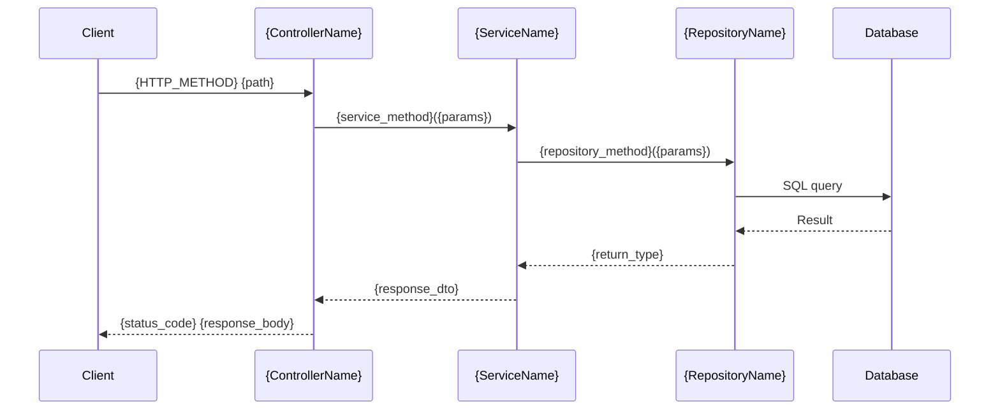
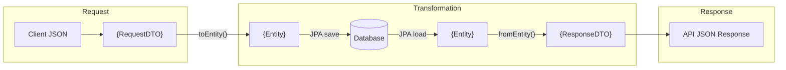
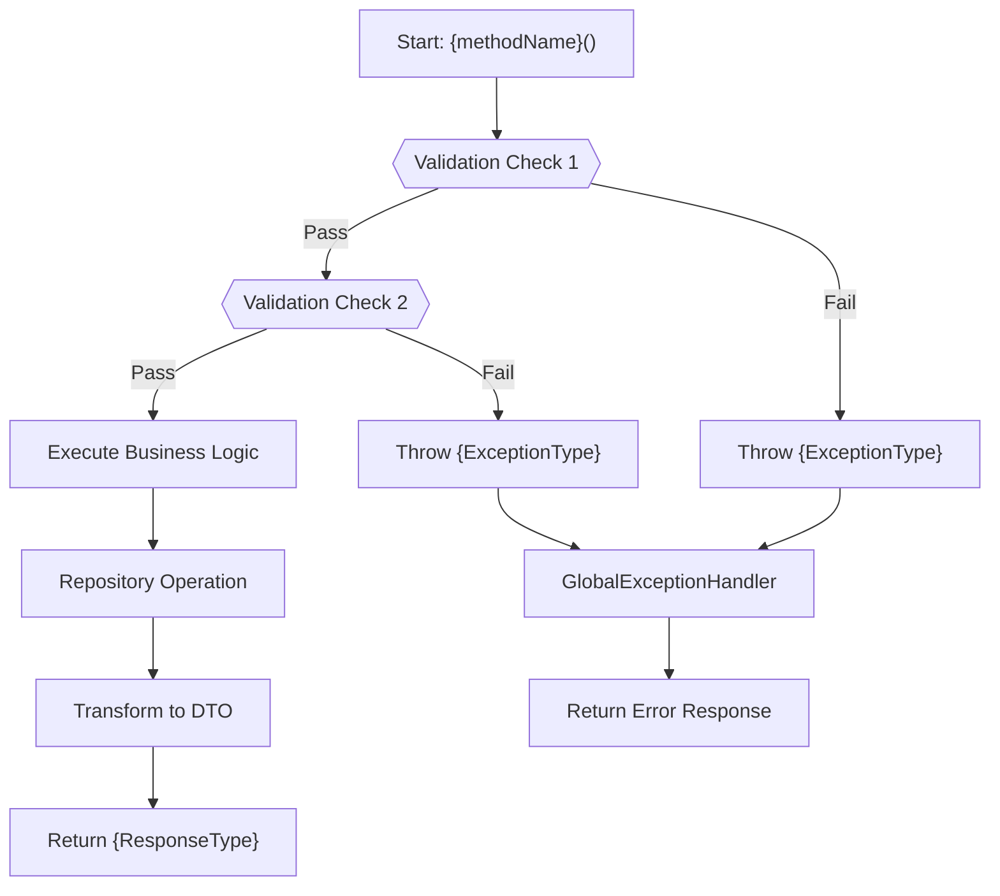
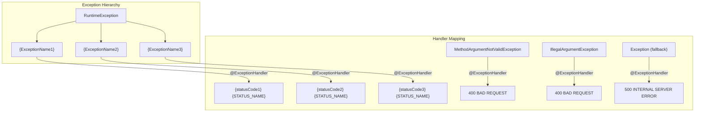
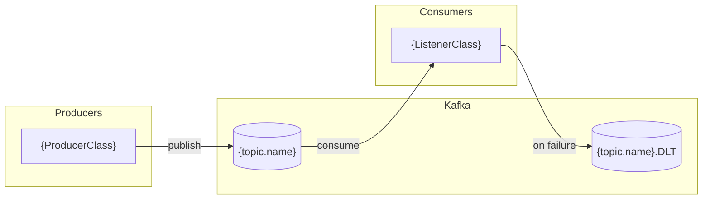

# Document Templates

These templates define the structure for each generated documentation file. Replace `{placeholders}` with actual values extracted from code.

---

## Template: API_REFERENCE.md
```markdown
# API Reference
> Auto-generated on {DATE} by Documentation Agent
> Source: {controller_file_paths}

## Base URL
`{protocol}://{host}:{port}{context-path}`

## Authentication
{auth_details_or_none}

## Endpoints

### {GROUP_NAME}

#### {HTTP_METHOD} `{full_path}`
**Summary**: {swagger_summary}
**Description**: {swagger_description}

**Parameters**:
| Name | In | Type | Required | Description |
|------|-----|------|----------|-------------|
| {name} | {path/query/header} | {type} | {yes/no} | {description} |

**Request Body**:
```json
{example_json}
```

**Validation Rules**:
| Field | Rule | Details |
|-------|------|---------|
| {field} | {annotation} | {message} |

**Response** (`{status_code}`):
```json
{example_response_json}
```

**Error Responses**:
| Status | Condition | Response |
|--------|-----------|----------|
| {code} | {when} | {body} |

**Endpoint Flow Diagram** (include for every endpoint):

```

---

## Template: ENTITY_REFERENCE.md
```markdown
# Entity Reference
> Auto-generated on {DATE}

## {EntityName}
**File**: {file_path}
**Table**: `{table_name}`

### Fields
| Field | Column | Type | Constraints | Default | Description |
|-------|--------|------|-------------|---------|-------------|
| {field} | {column} | {type} | {constraints} | {default} | {description} |

### Indexes
| Name | Columns | Unique |
|------|---------|--------|

### Relationships
| Field | Type | Target | Cascade |
|-------|------|--------|---------|

### Lifecycle Hooks
- `@PrePersist`: {behavior}
- `@PreUpdate`: {behavior}

### Enum: {EnumName}
| Value | Ordinal | Description |
|-------|---------|-------------|

## Entity Class Diagram
Generate a FULL Mermaid class diagram showing ALL entities, their fields, types, and relationships:
```mermaid
classDiagram
    class {EntityName} {
        -{type} {field}
        +{returnType} {method}()
    }
    class {EnumName} {
        <<enumeration>>
        {VALUE_1}
        {VALUE_2}
    }
    {EntityName} --> {EnumName} : userType
    {EntityName} "1" --> "*" {RelatedEntity} : {relationship}
```

## DTO Transformation Flow

```

---

## Template: SERVICE_REFERENCE.md
```markdown
# Service Reference
> Auto-generated on {DATE}

## {ServiceName}
**File**: {file_path}
**Annotations**: {annotations}
**Dependencies**: {injected_dependencies}

### Methods

#### `{method_signature}`
**Access**: {public/private}
**Transaction**: {readOnly/readWrite/none}
**Description**: {javadoc_or_inferred}

**Business Rules**:
1. {rule_1}
2. {rule_2}

**Throws**:
| Exception | Condition |
|-----------|-----------|
| {exception} | {when} |

**Called By**: {list_of_callers}
**Calls**: {list_of_called_methods}

## Service Class Diagram
```mermaid
classDiagram
    class {ServiceName} {
        -{RepositoryType} {repository}
        +{ReturnType} {methodName}({ParamType} {param})
    }
    class {RepositoryName} {
        <<interface>>
        +{ReturnType} {methodName}({ParamType} {param})
    }
    {ServiceName} --> {RepositoryName} : depends on
```

## Method Flow Diagrams
For each service method, generate a flowchart showing the business logic path:


## Exception Flow Diagram

```

---

## Template: GETTING_STARTED.md
```markdown
# Getting Started
> Auto-generated on {DATE}

## Prerequisites
- {language} {version}+
- {build_tool} {version}+
- {database} (optional: {auto_configured_note})

## Quick Start
```bash
{clone_and_run_commands}
```

## Verify Installation
```bash
{health_check_command}
```

## Project Structure
```
{project_tree}
```

## Key URLs
| URL | Description |
|-----|-------------|
| {url} | {description} |

## Next Steps
- Read [API Reference](../api/API_REFERENCE.md)
- Read [Architecture](../architecture/SYSTEM_ARCHITECTURE.md)
```

---

## Template: EVENT_CATALOG.md
```markdown
# Event Catalog
> Auto-generated on {DATE} by Documentation Agent
> Source: All Kafka/messaging configuration and listener/producer classes

## Overview
| Property | Value |
|----------|-------|
| Messaging Platform | {Kafka / RabbitMQ / SQS} |
| Serialization Format | {CloudEvents 1.0 / Avro / JSON} |
| Bootstrap Servers Config | `${ENV_VAR:default}` |

## Topics

### Topic: `{topic.name}`
| Property | Value |
|----------|-------|
| Partitions | {count_or_default} |
| Retention | {retention_period} |
| Key Type | {String / UUID / null} |
| Value Type | {DTO class or CloudEvent} |
| DLQ Topic | `{topic.name}.DLT` (if configured) |

**Producers:**
| Producer Class | Method | When Published |
|----------------|--------|----------------|
| {ProducerClass} | {method()} | {trigger condition in plain English} |

**Consumers:**
| Consumer Class | Method | Group ID | Concurrency | Retry Policy |
|----------------|--------|----------|-------------|---------------|
| {ListenerClass} | {method()} | `{group.id}` | {concurrency} | {retry count + backoff} |

**Payload Schema:**
```json
{
  "type": "{event_type}",
  "source": "{source_uri}",
  "data": {
    "{field}": "{type} — {description}"
  }
}
```

## Consumer Group Summary
| Group ID | Topics Consumed | Listener Class |
|----------|-----------------|----------------|
| {group.id} | {topic1}, {topic2} | {ListenerClass} |

## Error Handling
| Scenario | Behavior |
|----------|----------|
| Deserialization failure | {behavior: skip / DLT / retry} |
| Processing exception | {behavior: retry N times then DLT} |
| DLT routing | {DLT topic name and config} |

## Event Flow Diagram

```
