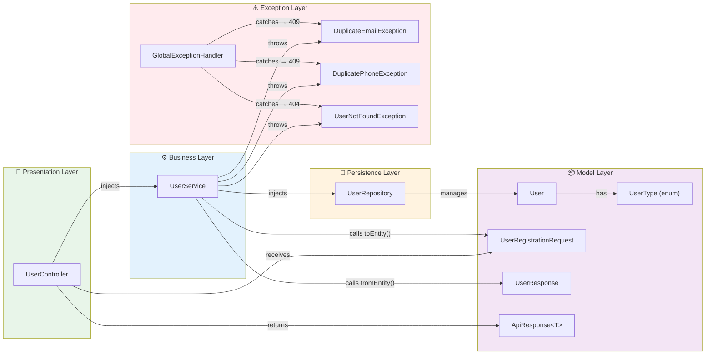
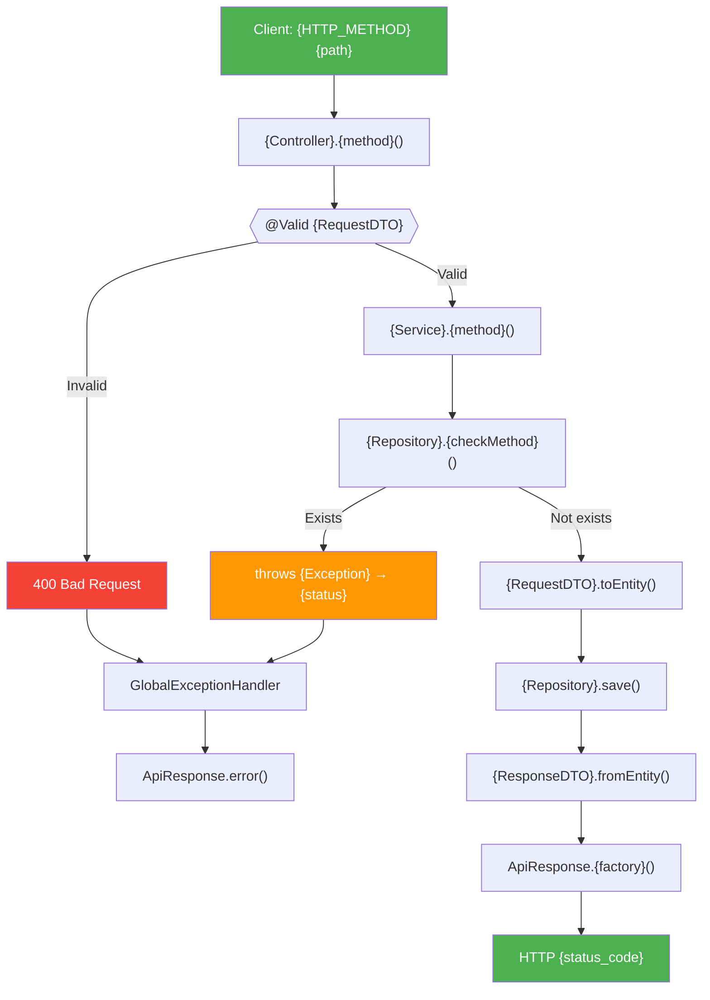

# Knowledge Graph Templates

Templates for the `docs/knowledge-graph/` folder. These generate node-edge representations of the entire project for impact analysis and onboarding.

---

## Template: SERVICE_KNOWLEDGE_GRAPH.md
```markdown
# Service Knowledge Graph
> Auto-generated on {DATE} by Documentation Agent
> Source: All source files in {project_root}

## Node Registry
| Node ID | Type | Layer | File |
|---------|------|-------|------|
| UserController | Class (Controller) | Presentation | {path} |
| UserService | Class (Service) | Business | {path} |
| UserRepository | Interface (Repository) | Persistence | {path} |
| User | Class (Entity) | Model | {path} |
| UserRegistrationRequest | Class (DTO) | Model | {path} |
| UserResponse | Class (DTO) | Model | {path} |
| ApiResponse | Class (Generic DTO) | Model | {path} |
| GlobalExceptionHandler | Class (Advice) | Cross-cutting | {path} |
| DuplicateEmailException | Class (Exception) | Cross-cutting | {path} |

## Edge Registry
| From | Edge Type | To | Label |
|------|-----------|-----|-------|
| UserController | injects | UserService | @RequiredArgsConstructor |
| UserService | injects | UserRepository | @RequiredArgsConstructor |
| UserController | receives | UserRegistrationRequest | @RequestBody |
| UserController | returns | ApiResponse<UserResponse> | ResponseEntity |
| UserService | calls | UserRegistrationRequest.toEntity() | DTO→Entity |
| UserService | calls | UserResponse.fromEntity() | Entity→DTO |
| UserService | throws | DuplicateEmailException | email exists |
| UserService | throws | DuplicatePhoneException | phone exists |
| UserService | throws | UserNotFoundException | ID not found |
| UserRepository | manages | User | JpaRepository |
| GlobalExceptionHandler | catches | DuplicateEmailException | → 409 |
| GlobalExceptionHandler | catches | UserNotFoundException | → 404 |

## Full Knowledge Graph


## Dependency Adjacency Matrix
| Component → Uses ↓ | Controller | Service | Repository | Entity | RequestDTO | ResponseDTO | Exceptions |
|---------------------|:----------:|:-------:|:----------:|:------:|:----------:|:-----------:|:----------:|
| **Controller** | — | ✅ | ❌ | ❌ | ✅ | ✅ | ❌ |
| **Service** | ❌ | — | ✅ | ✅ | ✅ | ✅ | ✅ |
| **Repository** | ❌ | ❌ | — | ✅ | ❌ | ❌ | ❌ |
| **ExceptionHandler** | ❌ | ❌ | ❌ | ❌ | ❌ | ❌ | ✅ |
```

---

## Template: ENDPOINT_FLOW_GRAPH.md
```markdown
# Endpoint Flow Graph
> Auto-generated on {DATE} by Documentation Agent

## {HTTP_METHOD} {full_path}
**Controller**: `{ControllerClass}.{method}()`
**Service**: `{ServiceClass}.{method}()`

### Node-Edge Chain
```
[Client]
  │
  ├──▶ [{ControllerClass}.{method}()]
  │       │
  │       ├── validates: @Valid → {RequestDTO}
  │       │     └── rules: {validation_rules}
  │       │
  │       ├──▶ [{ServiceClass}.{method}()]
  │       │       │
  │       │       ├── checks: [{RepositoryClass}.{checkMethod}()] → {return_type}
  │       │       │     └── on fail: throws {ExceptionType}
  │       │       │
  │       │       ├── transforms: [{RequestDTO}.toEntity()] → {Entity}
  │       │       │
  │       │       ├── persists: [{RepositoryClass}.save()] → {Entity}
  │       │       │
  │       │       └── transforms: [{ResponseDTO}.fromEntity()] → {ResponseDTO}
  │       │
  │       └── wraps: [ApiResponse.{factory}()] → ResponseEntity<{status}>
  │
  └──◀ HTTP {status_code} + JSON body
```

### Mermaid Flow


### Exception Branches
| Step | Exception | HTTP Status | Condition |
|------|-----------|-------------|----------|
| {step_num} | {ExceptionType} | {status} | {condition} |
```

---

## Template: METHOD_SUMMARY.md
```markdown
# Method Summary
> Auto-generated on {DATE} by Documentation Agent
> Summaries are **Javadoc-verified** — each summary is cross-checked against actual code.
> See instructions/doc-javadoc-verification.md for verification process.

## Javadoc Health Report
| Metric | Count | Percentage |
|--------|-------|------------|
| Total Methods Scanned | {count} | 100% |
| ✅ Javadoc Up-to-Date | {count} | {percent}% |
| ⚠️ Javadoc Stale/Partial | {count} | {percent}% |
| ❌ Javadoc Missing | {count} | {percent}% |

---

## {ClassName}
**File**: {file_path}
**Layer**: {Controller/Service/Repository/Model}

### `{method_signature}`
**Javadoc Status**: ✅ Verified | ⚠️ Stale | ❌ Missing
**Summary Source**: Javadoc | Generated from code

**Summary**: {verified_summary_text}

**Javadoc Verification**:
| Check | Expected | Actual | Status |
|-------|----------|--------|---------|
| @param {name} | {type} | {actual_type} | ✅/❌ |
| @return | {documented_type} | {actual_return} | ✅/❌ |
| @throws {exception} | {documented} | {actually_thrown} | ✅/❌ |
| Description | "{javadoc_desc}" | "{actual_behavior}" | ✅/⚠️ |
| Business Rules | {documented_rules} | {actual_rules} | ✅/⚠️ |

**Stale Javadoc Findings** (if any):
> ⚠️ {finding_description}
> Recommendation: {fix_suggestion}

**Details**:
| Property | Value |
|----------|-------|
| **Input** | `{param_type} {param_name}` |
| **Output** | `{return_type}` |
| **Annotations** | `{annotations_list}` |
| **Transaction** | {readOnly/readWrite/none} |
| **Called By** | `{CallerClass}.{callerMethod}()` |
| **Calls** | `{CalledClass}.{calledMethod}()` |
| **Throws** | `{ExceptionType}` — when {condition} |
| **TODOs** | {todo_text_or_none} |

**Step-by-Step Logic**:
1. {step_1_description}
2. {step_2_description}
3. {step_3_description}
```

---

## Template: CALL_GRAPH.md
```markdown
# Call Graph
> Auto-generated on {DATE} by Documentation Agent
> Shows every method-to-method call in the project as a directed graph.

## Full Call Graph

```mermaid
graph TD
    subgraph Controller
        C1["{Controller}.registerUser()"]
        C2["{Controller}.getUserById()"]
        C3["{Controller}.getUserByEmail()"]
        C4["{Controller}.getAllUsers()"]
        C5["{Controller}.getUsersByType()"]
        C6["{Controller}.getUsersByCity()"]
        C7["{Controller}.checkEmailAvailability()"]
        C8["{Controller}.verifyEmail()"]
        C9["{Controller}.deactivateUser()"]
        C10["{Controller}.getUserCountByType()"]
        C11["{Controller}.healthCheck()"]
    end
    subgraph Service
        S1["{Service}.registerUser()"]
        S2["{Service}.getUserById()"]
        S3["{Service}.getUserByEmail()"]
        S4["{Service}.getAllUsers()"]
        S5["{Service}.getUsersByType()"]
        S6["{Service}.getUsersByCity()"]
        S7["{Service}.isEmailAvailable()"]
        S8["{Service}.updateEmailVerification()"]
        S9["{Service}.deactivateUser()"]
        S10["{Service}.getUserCountByType()"]
    end
    subgraph Repository
        R1["{Repo}.existsByEmail()"]
        R2["{Repo}.existsByPhoneNumber()"]
        R3["{Repo}.save()"]
        R4["{Repo}.findById()"]
        R5["{Repo}.findByEmail()"]
        R6["{Repo}.findAll()"]
        R7["{Repo}.findByUserType()"]
        R8["{Repo}.findByCity()"]
        R9["{Repo}.countByUserType()"]
    end
    subgraph DTO
        D1["{RequestDTO}.toEntity()"]
        D2["{ResponseDTO}.fromEntity()"]
    end

    C1 --> S1
    S1 --> R1
    S1 --> R2
    S1 --> D1
    S1 --> R3
    S1 --> D2

    C2 --> S2
    S2 --> R4
    S2 --> D2

    C3 --> S3
    S3 --> R5
    S3 --> D2

    C4 --> S4
    S4 --> R6
    S4 --> D2

    C5 --> S5
    S5 --> R7
    S5 --> D2

    C6 --> S6
    S6 --> R8
    S6 --> D2

    C7 --> S7
    S7 --> R1

    C8 --> S8
    S8 --> R4
    S8 --> R3
    S8 --> D2

    C9 --> S9
    S9 --> R4
    S9 --> R3
    S9 --> D2

    C10 --> S10
    S10 --> R9
```


## Fan-In Analysis (Who calls this method?)
| Method | Called By | Fan-In Count |
|--------|-----------|-------------|
| `{Repo}.findById()` | `{Service}.getUserById()`, `{Service}.updateEmailVerification()`, `{Service}.deactivateUser()` | 3 |
| `{ResponseDTO}.fromEntity()` | `{Service}.registerUser()`, `{Service}.getUserById()`, ... | {count} |
| `{Repo}.save()` | `{Service}.registerUser()`, `{Service}.updateEmailVerification()`, `{Service}.deactivateUser()` | 3 |

## Fan-Out Analysis (What does this method call?)
| Method | Calls | Fan-Out Count |
|--------|-------|---------------|
| `{Service}.registerUser()` | `existsByEmail()`, `existsByPhoneNumber()`, `toEntity()`, `save()`, `fromEntity()` | 5 |
| `{Service}.getUserById()` | `findById()`, `fromEntity()` | 2 |

## Impact Analysis Helper
To assess impact of changing a method, trace its fan-in:
```
If you change: {Repository}.findByEmail()
  ↑ Called by: {Service}.getUserByEmail()
    ↑ Called by: {Controller}.getUserByEmail()
      ↑ Exposed at: GET /api/user-service/users/email/{email}

IMPACT: API endpoint affected, test coverage needed for getUserByEmail()
```
```
